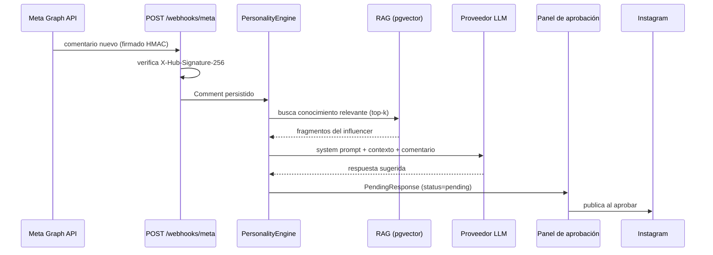

# Arquitectura

VirtualVoice responde comentarios de Instagram con la voz de un influencer virtual. Un humano aprueba antes de publicar: el sistema propone, nunca decide solo.

## Flujo de un comentario



El punto importante: entre el LLM e Instagram **siempre** hay una persona. `PendingResponse` nace en `pending` y solo un usuario autenticado lo mueve a `approved`, `edited` o `ignored`.

## Monorepo

```
backend/     FastAPI + PostgreSQL/pgvector — Railway
frontend/    Next.js App Router — Vercel
docs/        esta documentación
```

Los dos despliegan por separado. El frontend habla con el backend por HTTP; no comparten runtime.

## Backend

### Capas

| Capa | Ubicación | Responsabilidad |
|------|-----------|-----------------|
| Routers | `app/routers/` | HTTP: validación, auth, rate limiting |
| Core | `app/core/` | Lógica de dominio: personalidad, LLM, integración con Meta |
| Services | `app/services/` | Trabajo transversal con dependencias externas (Cloudinary) |
| Models | `app/models/` | SQLAlchemy |
| Schemas | `app/schemas/` | Pydantic — el contrato de la API |
| Utils | `app/utils/` | Cifrado, rate limiting, helpers |

### Endpoints

| Router | Rutas |
|--------|-------|
| `auth` | `POST /auth/register`, `/login`, `/google`, `/logout` · `GET /auth/me` |
| `influencers` | `GET/POST /influencers/` · `GET/PATCH /influencers/{id}` |
| `knowledge` | `GET/POST /knowledge/` · `PATCH/DELETE /knowledge/{id}` |
| `responses` | `GET /responses/pending`, `/history` · `POST /responses/{id}/approve`, `/ignore`, `/regenerate` |
| `social_accounts` | `GET /social-accounts/` · `GET /instagram/authorize`, `/instagram/callback` · `DELETE /{id}` |
| `metrics` | `GET /metrics/` |
| `studio` | `GET /studio/stats`, `/users` · `POST /studio/users` · `PATCH /users/{id}/role`, `/status` |
| `webhooks` | `GET/POST /webhooks/meta` |

### Motor de personalidad

`app/core/personality/` arma cada respuesta en tres pasos:

1. **`rag.py`** — `retrieve_relevant_knowledge()` busca los `k=5` fragmentos más cercanos al comentario, por similitud vectorial sobre `knowledge_entries.embedding` (pgvector), acotado al influencer.
2. **`prompt_builder.py`** — compone el system prompt: `system_prompt_core` del influencer + `current_context` (nota situacional libre) + fecha de hoy + el conocimiento recuperado.
3. **`engine.py`** — `PersonalityEngine.generate()` llama al proveedor LLM y devuelve el texto.

El `current_context` existe porque un influencer virtual necesita saber "qué le está pasando hoy" sin reescribir su prompt base.

### Capa de proveedores LLM

`app/core/llm/` define una interfaz mínima:

```python
async def generate(system_prompt: str, user_message: str) -> str
```

Tres implementaciones la cumplen:

| Implementación | Cubre |
|---|---|
| `GeminiProvider` | Google Gemini, SDK nativo |
| `AnthropicProvider` | Anthropic Claude, SDK nativo |
| `OpenAICompatibleProvider` | OpenAI, DeepSeek, Qwen, Perplexity, Groq, Mistral, Ollama y cualquier endpoint compatible |

`factory.get_provider()` resuelve cuál usar desde `LLM_PROVIDER`. Agregar un proveedor compatible con OpenAI no requiere código: basta con sus variables de entorno.

Cada influencer puede sobrescribir el proveedor global con su campo `llm_provider`, restringido por un `Literal` en el schema — es entrada de admin que termina eligiendo a qué host se conecta el servidor, así que la lista es cerrada a propósito.

### Integración con Meta

`app/core/meta/`:

- `oauth.py` — flujo de OAuth, `state` firmado con HMAC y ventana de 10 minutos
- `graph_api.py` — llamadas a la Graph API
- `webhook_handler.py` — procesamiento de eventos entrantes
- `token_manager.py` / `token_renewal.py` — renovación de tokens de larga duración

Dos tareas de fondo arrancan con la app (`lifespan` en `main.py`): renovación de tokens y limpieza de la denylist de JWT.

## Base de datos

PostgreSQL con la extensión `vector`.

| Tabla | Contenido |
|-------|-----------|
| `users` | Cuentas del panel. `role`: `user` \| `admin` \| `superadmin` |
| `influencers` | Personalidad: `system_prompt_core`, `current_context`, `llm_provider` |
| `social_accounts` | Cuentas de Instagram conectadas. Token cifrado con Fernet |
| `comments` | Comentarios recibidos por webhook |
| `pending_responses` | Respuestas generadas y su ciclo de aprobación |
| `knowledge_entries` | Base de conocimiento por influencer + columna `embedding` |
| `token_denylist` | JWT revocados en logout |

Migraciones con Alembic en `backend/alembic/versions/`.

## Frontend

Next.js App Router. NextAuth para sesión, con el JWT del backend en `session.accessToken`.

| Ruta | Para qué |
|------|----------|
| `/login`, `/register` | Email/password y Google SSO |
| `/dashboard` | Resumen |
| `/dashboard/queue` | Cola de aprobación — poll cada 30s |
| `/dashboard/history` | Respuestas ya resueltas |
| `/dashboard/influencers` | Alta y edición, más cuentas sociales |
| `/dashboard/knowledge` | Base de conocimiento |
| `/dashboard/metrics` | Métricas |
| `/studio`, `/studio/users` | Administración — solo `superadmin` |

Las imágenes pasan por un loader propio de `next/image` (`src/lib/cloudinary-loader.ts`) que apunta a Cloudinary. El optimizador de Vercel queda apagado a propósito — ver [operación](operations.md#imágenes).
