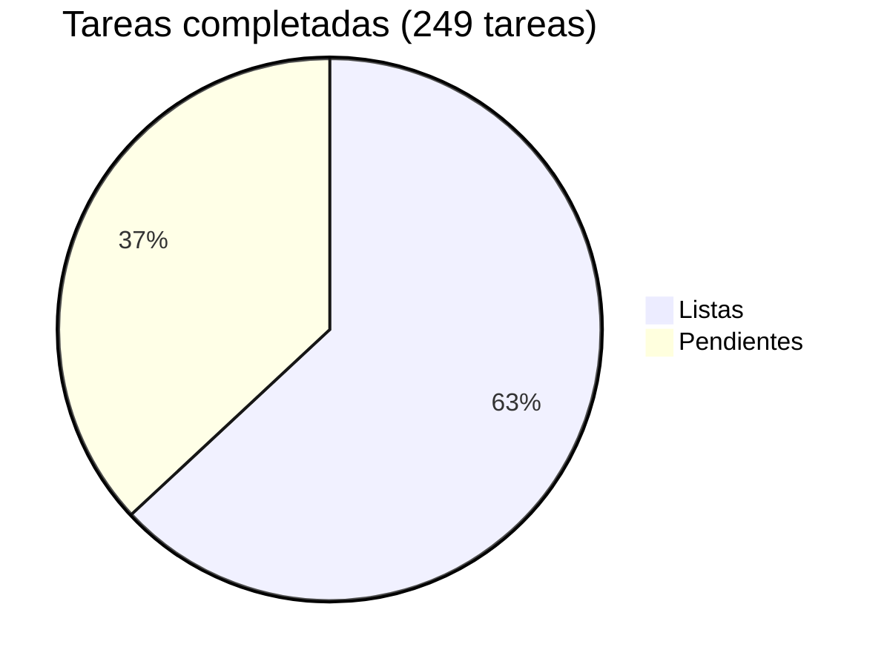

# VirtualVoice — Roadmap

> **Complejidad:** 🟢 Baja · 🟡 Media · 🔴 Alta
> **Estado:** ✅ Done · 🔧 En progreso · ⬜ Pendiente

## Progreso general

| Fase | Nombre | Listas | Pendientes | Progreso |
|------|--------|-------:|-----------:|----------|
| 0 | [Base Infrastructure](phase-00-base-infrastructure.md) | 8 | 0 | ✅ 100% |
| 1 | [Backend Core (MVP)](phase-01-backend-core.md) | 53 | 0 | ✅ 100% |
| 2 | [Frontend (Approval Panel)](phase-02-frontend-approval-panel.md) | 28 | 0 | ✅ 100% |
| 3 | [RAG + Multi-influencer](phase-03-rag-multi-influencer.md) | 6 | 0 | ✅ 100% |
| 4 | [Quality & Intelligence](phase-04-quality-intelligence.md) | 3 | 0 | ✅ 100% |
| 4.5 | [Platform Expansion](phase-04.5-platform-expansion.md) | 0 | 16 | ⬜ 0% |
| 4.6 | [Creator Monetization Platforms](phase-04.6-creator-monetization.md) | 0 | 15 | ⬜ 0% |
| 5 | [Production](phase-05-production.md) | 6 | 1 | 🟡 86% |
| 5.5 | [Voice Layer (ElevenLabs)](phase-05.5-voice-layer.md) | 0 | 23 | ⬜ 0% |
| 6 | [Security Hardening](phase-06-security-hardening.md) | 18 | 0 | ✅ 100% |
| 7 | [Security Hardening Round 2](phase-07-security-hardening-round-2.md) | 19 | 0 | ✅ 100% |
| 8 | [Security Hardening Round 3](phase-08-security-hardening-round-3.md) | 16 | 0 | ✅ 100% |
| 9 | [ATH Signal & Filtering](phase-09-ath-signal-filtering.md) | 0 | 16 | ⬜ 0% |
| 10 | [ATH Intelligence](phase-10-ath-intelligence.md) | 0 | 21 | ⬜ 0% |
| **Total** | | **157** | **92** | **🟡 63%** |

> **Pendientes (92).** El producto funciona de punta a punta: recibe comentarios,
> genera respuestas con personalidad y las publica tras aprobación humana. Lo que
> queda abierto es expansión, no deuda del núcleo.
>
> - **Fases 9 y 10 (37 tareas)** — señal y filtrado de contenido entrante, más
>   inteligencia sobre esa señal. Es lo más grande sin empezar.
> - **Fases 4.5 y 4.6** — expansión de plataformas y monetización. Hoy solo
>   Instagram está integrado.
> - **Fase 5** (producción) y **5.5** (capa de voz con ElevenLabs).
> - **Fase 6** (endurecimiento de seguridad) quedó parcialmente absorbida por las
>   rondas 2 y 3, que sí están completas. Ver [seguridad](../security.md) para el
>   estado real, que es mejor de lo que sugiere el porcentaje de esa fila.
>
> Las fases 0 a 4 y 7 a 8 están al 100%.
